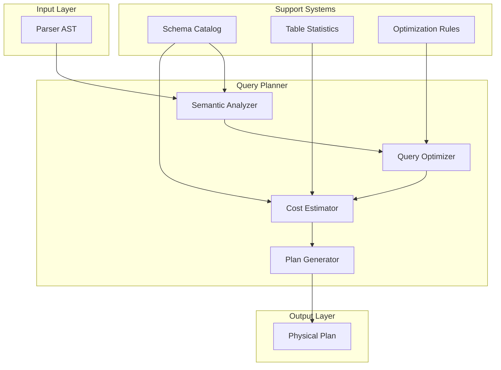
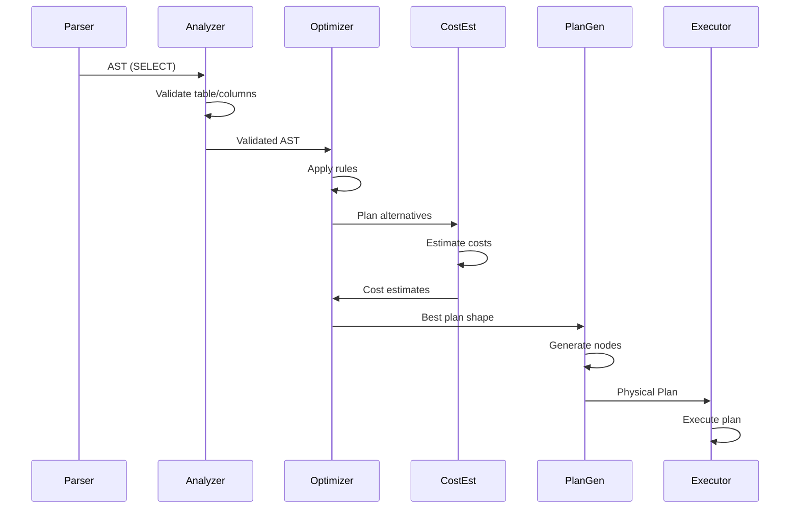
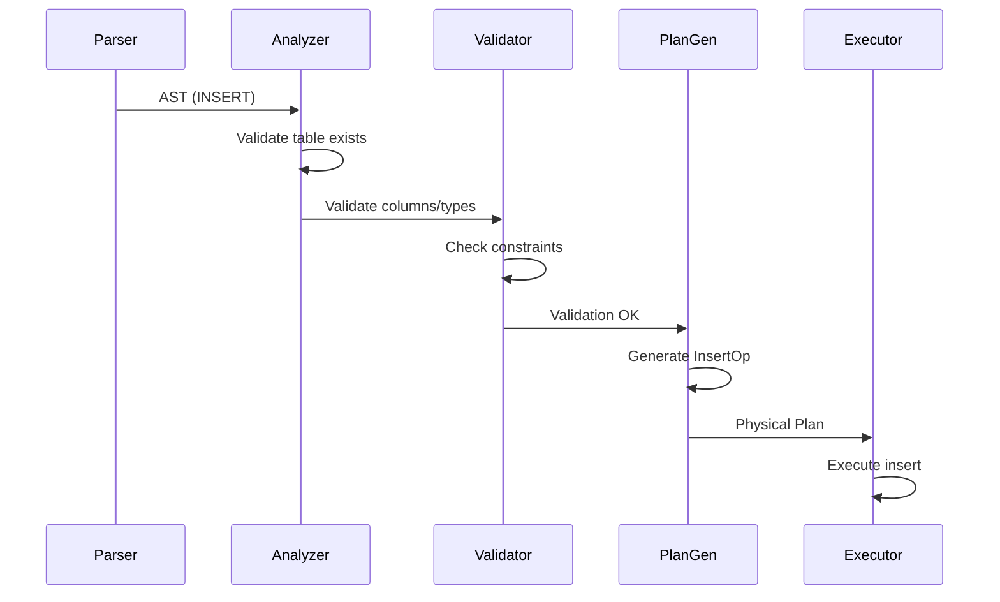
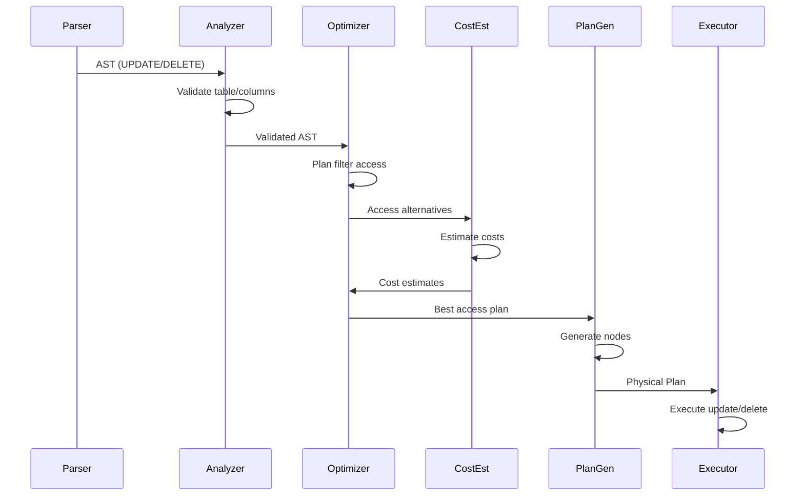

# Query Planner Design

## Overview

The Query Planner is the critical component that transforms parsed SQL Abstract Syntax Trees (ASTs) into optimized physical execution plans. It sits between the SQL Parser and the Executor, making intelligent decisions about how to access data, filter rows, and combine results from multiple sources.

**Key Responsibilities:**
- Transform parser AST into executable plan nodes
- Select optimal access paths (sequential scan vs. index scan)
- Determine join ordering for multi-table queries
- Estimate costs for different plan alternatives
- Apply optimization rules and transformations
- Validate schema and type compatibility

**Architecture Position:**
```
SQL String
    ↓
[Parser] → AST
    ↓
[Query Planner] → Physical Plan
    ↓
[Executor] → Result Rows
```

## High-Level Architecture

### System Components



### Component Responsibilities

**Semantic Analyzer**
- Validates table and column references against schema catalog
- Resolves column names to table sources
- Validates data types and expressions
- Checks for ambiguous column references
- Enforces constraint compatibility

**Query Optimizer**
- Applies logical transformation rules
- Explores alternative plan shapes
- Selects best plan based on cost estimates
- Handles join reordering
- Applies predicate pushdown

**Cost Estimator**
- Estimates row counts (cardinality)
- Estimates I/O costs for different access paths
- Estimates CPU costs for operations
- Provides cost comparison for plan alternatives
- Uses table statistics from catalog

**Plan Generator**
- Constructs physical plan nodes
- Assigns concrete operators (SeqScan, IndexScan, Join, etc.)
- Embeds cost estimates in plan
- Validates plan correctness

### Data Flow for Different Query Types

#### SELECT Query Flow



#### INSERT Query Flow



#### UPDATE/DELETE Query Flow



## Low-Level Design

### Plan Node Hierarchy

```
Operator (interface)
├── TableAccessOp
│   ├── SeqScanOp
│   └── IndexScanOp
├── FilterOp
├── ProjectionOp
├── JoinOp
│   ├── NestedLoopJoinOp
│   ├── HashJoinOp
│   └── SortMergeJoinOp
├── SortOp
├── AggregateOp
├── LimitOp
├── DML Operations
│   ├── InsertOp
│   ├── UpdateOp
│   ├── DeleteOp
│   └── CreateTableOp
└── DDL Operations
    ├── DropTableOp
    ├── CreateIndexOp
    └── DropIndexOp
```

### Core Interfaces and Types

#### PlanNode Interface

```go
// Operator is the core interface for all plan nodes
type Operator interface {
    // Name returns the operator type name
    Name() string
    
    // EstimatedCost returns the estimated execution cost
    EstimatedCost() Cost
    
    // EstimatedRows returns estimated output row count
    EstimatedRows() int64
    
    // OutputColumns returns column names produced by this operator
    OutputColumns() []string
}

// Cost represents execution cost metrics
type Cost struct {
    IOCost    float64  // I/O operations cost
    CPUCost   float64  // CPU operations cost
    TotalCost float64  // Total estimated cost
}

// TableAccessOp is the base for table access operators
type TableAccessOp struct {
    Schema          string
    Table           string
    Columns         []string
    Filter          string    // Deprecated
    FilterExpr      expr.Expr // Structured filter
    EstimatedCost   Cost
    EstimatedRowCnt int64
}

// SeqScanOp represents a full table scan
type SeqScanOp struct {
    TableAccessOp
}

// IndexScanOp represents an index-based scan
type IndexScanOp struct {
    TableAccessOp
    IndexName  string
    StartKey   []byte  // For range scans
    EndKey     []byte  // For range scans
    IsRangeScan bool
}

// FilterOp applies predicates to rows
type FilterOp struct {
    Child      Operator
    Predicate  expr.Expr
    EstimatedCost   Cost
    EstimatedRowCnt int64
}

// ProjectionOp selects specific columns
type ProjectionOp struct {
    Child      Operator
    Columns    []string
    EstimatedCost   Cost
    EstimatedRowCnt int64
}

// JoinOp represents a join operation
type JoinOp interface {
    Operator
    LeftChild() Operator
    RightChild() Operator
    JoinCondition() expr.Expr
    JoinType() JoinType
}

type JoinType string
const (
    InnerJoin JoinType = "INNER"
    LeftJoin  JoinType = "LEFT"
    RightJoin JoinType = "RIGHT"
    FullJoin  JoinType = "FULL"
)

// NestedLoopJoinOp implements nested loop join
type NestedLoopJoinOp struct {
    Left       Operator
    Right      Operator
    Condition  expr.Expr
    Type       JoinType
    EstimatedCost   Cost
    EstimatedRowCnt int64
}

// SortOp sorts rows by specified columns
type SortOp struct {
    Child      Operator
    SortKeys   []SortKey
    EstimatedCost   Cost
    EstimatedRowCnt int64
}

type SortKey struct {
    Column    string
    Ascending bool
}

// AggregateOp performs aggregation
type AggregateOp struct {
    Child           Operator
    GroupByColumns  []string
    Aggregates      []AggregateFunc
    EstimatedCost   Cost
    EstimatedRowCnt int64
}

type AggregateFunc struct {
    Function string // COUNT, SUM, AVG, MIN, MAX
    Column   string
    Alias    string
}

// LimitOp limits output rows
type LimitOp struct {
    Child      Operator
    Limit      int64
    Offset     int64
    EstimatedCost   Cost
    EstimatedRowCnt int64
}
```

### Cost Estimation Algorithms

#### Cardinality Estimation

```pascal
ALGORITHM estimateCardinality(table, filter)
INPUT: table metadata, filter expression
OUTPUT: estimated row count

BEGIN
    // Base cardinality from table statistics
    baseRows ← table.Statistics.RowCount
    
    // If no filter, return base
    IF filter IS NULL THEN
        RETURN baseRows
    END IF
    
    // Estimate selectivity based on filter type
    selectivity ← estimateSelectivity(filter, table)
    
    // Apply selectivity to base cardinality
    estimatedRows ← baseRows * selectivity
    
    // Ensure minimum of 1 row
    RETURN MAX(1, estimatedRows)
END

ALGORITHM estimateSelectivity(filter, table)
INPUT: filter expression, table metadata
OUTPUT: selectivity factor (0.0 to 1.0)

BEGIN
    MATCH filter WITH
    
    CASE BinaryExpr(left, OpEquals, right):
        // Equality predicate
        IF left IS ColumnRef AND right IS Literal THEN
            column ← left.Name
            colStats ← table.Statistics.GetColumnStats(column)
            
            // Selectivity = 1 / distinct values
            selectivity ← 1.0 / colStats.DistinctValues
            RETURN selectivity
        END IF
        
    CASE BinaryExpr(left, OpLessThan, right):
        // Range predicate
        IF left IS ColumnRef AND right IS Literal THEN
            column ← left.Name
            colStats ← table.Statistics.GetColumnStats(column)
            
            // Estimate based on value distribution
            selectivity ← estimateRangeSelectivity(colStats, right)
            RETURN selectivity
        END IF
        
    CASE BinaryExpr(left, OpAnd, right):
        // Conjunction: multiply selectivities
        sel1 ← estimateSelectivity(left, table)
        sel2 ← estimateSelectivity(right, table)
        RETURN sel1 * sel2
        
    CASE BinaryExpr(left, OpOr, right):
        // Disjunction: add selectivities (simplified)
        sel1 ← estimateSelectivity(left, table)
        sel2 ← estimateSelectivity(right, table)
        RETURN MIN(1.0, sel1 + sel2)
        
    DEFAULT:
        // Unknown predicate: assume 10% selectivity
        RETURN 0.1
    END MATCH
END
```

#### I/O Cost Estimation

```pascal
ALGORITHM estimateIOCost(accessPath, table)
INPUT: access path (SeqScan or IndexScan), table metadata
OUTPUT: estimated I/O cost

BEGIN
    MATCH accessPath WITH
    
    CASE SeqScan:
        // Sequential scan: read all pages
        pageCount ← CEIL(table.Statistics.SizeBytes / PAGE_SIZE)
        ioCost ← pageCount * SEQUENTIAL_READ_COST
        RETURN ioCost
        
    CASE IndexScan(index, startKey, endKey):
        // Index scan: read index pages + data pages
        
        // Estimate index pages to read
        indexPageCount ← estimateIndexPages(index, startKey, endKey)
        indexIOCost ← indexPageCount * RANDOM_READ_COST
        
        // Estimate data pages to read
        rowsToFetch ← estimateRowsInRange(index, startKey, endKey)
        dataPageCount ← CEIL(rowsToFetch * AVG_ROW_SIZE / PAGE_SIZE)
        dataIOCost ← dataPageCount * RANDOM_READ_COST
        
        // Total I/O cost
        totalIOCost ← indexIOCost + dataIOCost
        RETURN totalIOCost
    END MATCH
END

ALGORITHM estimateIndexPages(index, startKey, endKey)
INPUT: index metadata, key range
OUTPUT: estimated number of index pages to read

BEGIN
    // Estimate based on index height and branching factor
    indexHeight ← index.Metadata.Height
    branchingFactor ← index.Metadata.BranchingFactor
    
    // Leaf pages to scan
    leafPages ← CEIL(index.Metadata.LeafPageCount * 
                     (endKey - startKey) / index.Metadata.KeyRange)
    
    // Internal pages (one per level)
    internalPages ← indexHeight - 1
    
    RETURN internalPages + leafPages
END
```

#### CPU Cost Estimation

```pascal
ALGORITHM estimateCPUCost(operation, rowCount)
INPUT: operation type, number of rows to process
OUTPUT: estimated CPU cost

BEGIN
    MATCH operation WITH
    
    CASE Filter(predicate):
        // Cost to evaluate predicate for each row
        predicateCost ← estimatePredicateCost(predicate)
        cpuCost ← rowCount * predicateCost
        RETURN cpuCost
        
    CASE Projection(columns):
        // Cost to extract columns for each row
        columnCost ← length(columns) * COLUMN_EXTRACT_COST
        cpuCost ← rowCount * columnCost
        RETURN cpuCost
        
    CASE Sort(sortKeys):
        // Cost to sort rows
        // O(n log n) comparison-based sort
        comparisons ← rowCount * LOG2(rowCount)
        cpuCost ← comparisons * COMPARISON_COST
        RETURN cpuCost
        
    CASE NestedLoopJoin(leftRows, rightRows):
        // Cost to compare each left row with all right rows
        comparisons ← leftRows * rightRows
        cpuCost ← comparisons * COMPARISON_COST
        RETURN cpuCost
        
    DEFAULT:
        // Default: linear cost in row count
        RETURN rowCount * DEFAULT_ROW_COST
    END MATCH
END
```

### Index Selection Strategy

```pascal
ALGORITHM selectBestIndex(table, filter)
INPUT: table metadata, filter expression
OUTPUT: best index to use or NULL for sequential scan

BEGIN
    // Extract indexed columns from filter
    indexableColumns ← extractIndexableColumns(filter)
    
    IF indexableColumns IS EMPTY THEN
        // No indexed columns in filter
        RETURN NULL
    END IF
    
    // Find all indexes that match indexed columns
    candidateIndexes ← []
    FOR EACH index IN table.Indexes DO
        IF indexCoversColumns(index, indexableColumns) THEN
            candidateIndexes.ADD(index)
        END IF
    END FOR
    
    IF candidateIndexes IS EMPTY THEN
        RETURN NULL
    END IF
    
    // Estimate cost for each candidate index
    bestIndex ← NULL
    bestCost ← INFINITY
    
    FOR EACH index IN candidateIndexes DO
        cost ← estimateIOCost(IndexScan(index), table)
        IF cost < bestCost THEN
            bestCost ← cost
            bestIndex ← index
        END IF
    END FOR
    
    // Compare with sequential scan cost
    seqScanCost ← estimateIOCost(SeqScan(), table)
    
    IF bestCost < seqScanCost THEN
        RETURN bestIndex
    ELSE
        RETURN NULL
    END IF
END

ALGORITHM extractIndexableColumns(filter)
INPUT: filter expression
OUTPUT: list of columns that can use indexes

BEGIN
    indexableColumns ← []
    
    MATCH filter WITH
    
    CASE BinaryExpr(ColumnRef(col), OpEquals, Literal):
        indexableColumns.ADD(col)
        
    CASE BinaryExpr(ColumnRef(col), OpLessThan, Literal):
        indexableColumns.ADD(col)
        
    CASE BinaryExpr(ColumnRef(col), OpGreaterThan, Literal):
        indexableColumns.ADD(col)
        
    CASE BinaryExpr(left, OpAnd, right):
        // Recursively extract from both sides
        indexableColumns.ADD_ALL(extractIndexableColumns(left))
        indexableColumns.ADD_ALL(extractIndexableColumns(right))
        
    DEFAULT:
        // Other expressions cannot use indexes
    END MATCH
    
    RETURN indexableColumns
END

ALGORITHM indexCoversColumns(index, columns)
INPUT: index definition, required columns
OUTPUT: whether index can be used for these columns

BEGIN
    // Check if index columns match required columns
    // For now, simple prefix matching
    
    FOR i = 0 TO length(columns) - 1 DO
        IF i >= length(index.Columns) THEN
            RETURN FALSE
        END IF
        
        IF index.Columns[i] != columns[i] THEN
            RETURN FALSE
        END IF
    END FOR
    
    RETURN TRUE
END
```

### Join Ordering Algorithm

```pascal
ALGORITHM orderJoins(tables, joinConditions)
INPUT: list of tables, join conditions between them
OUTPUT: optimal join order

BEGIN
    // For now, use simple heuristic: smallest table first
    // Future: implement dynamic programming (Selinger algorithm)
    
    // Calculate cardinality for each table
    tableCardinalities ← []
    FOR EACH table IN tables DO
        cardinality ← estimateCardinality(table, NULL)
        tableCardinalities.ADD((table, cardinality))
    END FOR
    
    // Sort by cardinality (ascending)
    SORT tableCardinalities BY cardinality
    
    // Build join order
    joinOrder ← []
    FOR EACH (table, _) IN tableCardinalities DO
        joinOrder.ADD(table)
    END FOR
    
    RETURN joinOrder
END

ALGORITHM buildJoinTree(tables, joinOrder, joinConditions)
INPUT: tables, optimal join order, join conditions
OUTPUT: tree of join operators

BEGIN
    // Start with first table
    currentPlan ← SeqScan(joinOrder[0])
    
    // Join with remaining tables in order
    FOR i = 1 TO length(joinOrder) - 1 DO
        nextTable ← joinOrder[i]
        nextPlan ← SeqScan(nextTable)
        
        // Find join condition between current and next
        condition ← findJoinCondition(currentPlan, nextTable, joinConditions)
        
        // Create join operator
        currentPlan ← NestedLoopJoin(currentPlan, nextPlan, condition)
    END FOR
    
    RETURN currentPlan
END
```

### Optimization Rules

#### Rule 1: Predicate Pushdown

```pascal
RULE predicatePushdown
PATTERN: Filter(Join(left, right), predicate)
CONDITION: predicate references only left table columns
REPLACEMENT: Join(Filter(left, predicate), right)
BENEFIT: Reduces rows before join, decreasing join cost
```

#### Rule 2: Index Selection

```pascal
RULE indexSelection
PATTERN: SeqScan(table, filter)
CONDITION: index exists for filter columns
REPLACEMENT: IndexScan(table, index, filter)
BENEFIT: Reduces I/O cost significantly
```

#### Rule 3: Column Pruning

```pascal
RULE columnPruning
PATTERN: Projection(child, columns)
CONDITION: child produces more columns than needed
REPLACEMENT: Modify child to produce only needed columns
BENEFIT: Reduces memory and I/O
```

#### Rule 4: Join Reordering

```pascal
RULE joinReordering
PATTERN: Join(Join(A, B), C)
CONDITION: cost(Join(A, Join(B, C))) < cost(Join(Join(A, B), C))
REPLACEMENT: Join(A, Join(B, C))
BENEFIT: Reduces intermediate result sizes
```

### Plan Validation

```pascal
ALGORITHM validatePlan(plan, catalog)
INPUT: physical plan, schema catalog
OUTPUT: validation result (valid or error)

BEGIN
    RETURN validateNode(plan.Root, catalog)
END

ALGORITHM validateNode(node, catalog)
INPUT: plan node, schema catalog
OUTPUT: validation result

BEGIN
    MATCH node WITH
    
    CASE SeqScan(schema, table, columns):
        // Validate table exists
        tableDef ← catalog.GetTable(schema, table)
        IF tableDef IS NULL THEN
            RETURN Error("Table not found")
        END IF
        
        // Validate columns exist
        FOR EACH col IN columns DO
            IF NOT tableDef.HasColumn(col) THEN
                RETURN Error("Column not found")
            END IF
        END FOR
        
        RETURN Valid()
        
    CASE Filter(child, predicate):
        // Validate child
        childResult ← validateNode(child, catalog)
        IF NOT childResult.IsValid THEN
            RETURN childResult
        END IF
        
        // Validate predicate references valid columns
        RETURN validateExpression(predicate, child.OutputColumns())
        
    CASE Join(left, right, condition):
        // Validate both children
        leftResult ← validateNode(left, catalog)
        IF NOT leftResult.IsValid THEN
            RETURN leftResult
        END IF
        
        rightResult ← validateNode(right, catalog)
        IF NOT rightResult.IsValid THEN
            RETURN rightResult
        END IF
        
        // Validate join condition
        allColumns ← left.OutputColumns() + right.OutputColumns()
        RETURN validateExpression(condition, allColumns)
        
    DEFAULT:
        RETURN Valid()
    END MATCH
END
```

## Integration Points

### Upstream Dependencies

**Parser** (`internal/sql/parser`)
- Provides: AST structures
- Consumes: Parsed SQL statements
- Interface: `parser.AST`

**Schema Catalog** (`internal/schema`)
- Provides: Table definitions, column metadata, index information
- Consumes: Schema queries
- Interface: `schema.Catalog`

### Downstream Consumers

**Executor** (`internal/sql/executor`)
- Consumes: Physical plans
- Provides: Row streams
- Interface: `planner.Plan`, `planner.Operator`

**Transaction Manager** (`internal/txn`)
- Consumes: Plan information for transaction tracking
- Provides: Transaction context
- Interface: `txn.Manager`

## Error Handling Strategy

### Validation Errors

```go
// Table not found
ErrTableNotFound = "table %s.%s not found"

// Column not found
ErrColumnNotFound = "column %s not found in table %s.%s"

// Type mismatch
ErrTypeMismatch = "type mismatch: expected %s, got %s"

// Ambiguous column reference
ErrAmbiguousColumn = "ambiguous column reference: %s"

// Invalid join condition
ErrInvalidJoinCondition = "invalid join condition: %s"

// Unsupported operation
ErrUnsupportedOperation = "unsupported operation: %s"
```

### Error Propagation

```pascal
ALGORITHM buildPlan(ast, catalog)
INPUT: parsed AST, schema catalog
OUTPUT: plan or error

BEGIN
    TRY
        // Semantic analysis
        validationResult ← validateAST(ast, catalog)
        IF NOT validationResult.IsValid THEN
            RETURN Error(validationResult.Message)
        END IF
        
        // Optimization
        optimizedAST ← optimizeAST(ast, catalog)
        
        // Plan generation
        plan ← generatePlan(optimizedAST, catalog)
        
        // Plan validation
        planValidation ← validatePlan(plan, catalog)
        IF NOT planValidation.IsValid THEN
            RETURN Error(planValidation.Message)
        END IF
        
        RETURN plan
        
    CATCH error
        RETURN Error(WRAP_ERROR(error))
    END TRY
END
```

## Testing Strategy

### Unit Testing Approach

- **Test Plan Node Creation**: Verify each operator type creates correct nodes
- **Test Cost Estimation**: Validate cost calculations against known values
- **Test Index Selection**: Verify correct index is chosen for different filters
- **Test Join Ordering**: Validate join order optimization
- **Test Validation**: Ensure invalid plans are rejected

### Property-Based Testing Approach

**Property Test Library**: `fast-check` (Go equivalent: `gopter` or custom)

**Key Properties to Test**:

1. **Plan Completeness**: Every table in FROM clause appears in plan
2. **Column Validity**: All referenced columns exist in source tables
3. **Cost Monotonicity**: Adding filters doesn't increase estimated cost
4. **Cardinality Bounds**: Estimated rows ≤ table row count
5. **Plan Determinism**: Same input produces same plan
6. **Cost Consistency**: Cost estimates are consistent across equivalent plans

### Integration Testing Approach

- **End-to-End**: Parse SQL → Plan → Execute → Verify results
- **Schema Integration**: Test with real catalog data
- **Performance**: Benchmark plan generation time
- **Regression**: Test against known query patterns

## Performance Considerations

### Plan Generation Time

- **Target**: < 10ms for typical queries
- **Optimization**: Cache frequently used plans
- **Heuristics**: Use greedy algorithms for join ordering

### Memory Usage

- **Plan Size**: Proportional to query complexity
- **Statistics Cache**: Keep table statistics in memory
- **Optimization**: Reuse plan nodes where possible

### Scalability

- **Table Count**: Support 100+ tables in single query
- **Join Depth**: Support 10+ table joins
- **Predicate Complexity**: Support complex nested predicates

## Security Considerations

### Input Validation

- Validate all column and table references
- Prevent SQL injection through plan construction
- Validate data types match schema

### Access Control

- Respect table and column permissions (future)
- Validate user has access to referenced tables
- Audit plan generation for sensitive queries

## Dependencies

### External Libraries

- `internal/schema`: Schema catalog and metadata
- `internal/sql/parser`: AST structures
- `internal/sql/expr`: Expression evaluation
- `internal/logging`: Debug logging

### Internal Modules

- `internal/storage/engine`: Storage engine interface
- `internal/txn`: Transaction management

## Correctness Properties

*A property is a characteristic or behavior that should hold true across all valid executions of a system—essentially, a formal statement about what the system should do. Properties serve as the bridge between human-readable specifications and machine-verifiable correctness guarantees.*

### Property 1: Semantic Validation Completeness

*For any* SELECT query with invalid table or column references, the Semantic_Analyzer SHALL reject the query and return a descriptive error message.

**Validates: Requirements 1.1, 1.2, 1.3, 1.4**

### Property 2: Plan Node Creation Correctness

*For any* valid SQL query (SELECT, INSERT, UPDATE, DELETE, DDL), the Plan_Generator SHALL create appropriate operator nodes that match the query structure.

**Validates: Requirements 2.1, 2.2, 2.3, 2.4, 2.5, 2.6, 2.7, 2.8, 2.9, 2.10, 2.11, 2.12, 2.13, 2.14**

### Property 3: Cardinality Estimation Accuracy

*For any* table with known statistics and any filter predicate, the Cost_Estimator SHALL estimate cardinality within reasonable bounds (1 ≤ estimated_rows ≤ table_row_count).

**Validates: Requirements 3.1, 3.2, 3.3, 3.4, 3.5, 3.6, 3.7, 3.8, 3.9**

### Property 4: I/O Cost Estimation Consistency

*For any* access path (sequential scan or index scan), the Cost_Estimator SHALL estimate I/O cost based on the specified formula, and index scan cost SHALL be lower than sequential scan cost when the index is selective.

**Validates: Requirements 4.1, 4.2, 4.3, 4.4, 4.5, 4.6**

### Property 5: CPU Cost Estimation Monotonicity

*For any* operation with increasing row count, the estimated CPU cost SHALL increase monotonically.

**Validates: Requirements 5.1, 5.2, 5.3, 5.4, 5.5**

### Property 6: Index Selection Optimality

*For any* query with indexed columns in the WHERE clause, the Query_Optimizer SHALL select an index if its estimated cost is lower than sequential scan cost.

**Validates: Requirements 6.1, 6.2, 6.3, 6.4, 6.5, 6.6, 6.7, 6.8**

### Property 7: Join Ordering Cost Minimization

*For any* multi-table query, the Query_Optimizer SHALL select a join order whose total estimated cost is less than or equal to alternative join orders.

**Validates: Requirements 7.1, 7.2, 7.3, 7.4, 7.5, 7.6**

### Property 8: Predicate Pushdown Correctness

*For any* filter applied after a join that references only one table, the Query_Optimizer SHALL push the filter down to apply before the join, reducing intermediate result cardinality.

**Validates: Requirements 8.1, 8.2, 8.3, 8.4, 8.5**

### Property 9: Plan Validation Completeness

*For any* invalid plan (missing tables, invalid columns, invalid join conditions), the Plan_Generator SHALL detect the error and return a descriptive error message.

**Validates: Requirements 9.1, 9.2, 9.3, 9.4, 9.5, 9.6, 9.7**

### Property 10: Error Message Specificity

*For any* validation error, the error message SHALL include specific context about the invalid reference (table name, column name, or operation).

**Validates: Requirements 10.1, 10.2, 10.3, 10.4, 10.5, 10.6, 10.7**

### Property 11: Scalability with Large Schemas

*For any* schema with 100+ tables and any query referencing a subset of those tables, the Query_Planner SHALL successfully generate a valid plan.

**Validates: Requirements 12.1, 12.2, 12.3, 12.4**

### Property 12: Plan Completeness

*For any* valid query, the generated plan SHALL include all tables referenced in the FROM clause, apply all predicates from the WHERE clause, and select only the columns specified in the SELECT list.

**Validates: Requirements 13.1, 13.2, 13.3, 13.4, 13.5, 13.6, 13.7, 13.8**

### Property 13: Planning Determinism

*For any* query, planning the same query multiple times with unchanged schema and statistics SHALL produce identical plans.

**Validates: Requirements 14.1, 14.2, 14.3**

## Future Enhancements

1. **Advanced Join Algorithms**: Hash join, sort-merge join
2. **Subquery Optimization**: Flatten subqueries, correlate subqueries
3. **Window Functions**: Support OVER clauses
4. **Materialized Views**: Use materialized views for optimization
5. **Parallel Execution**: Multi-threaded plan execution
6. **Adaptive Planning**: Adjust plans based on runtime statistics
7. **Query Caching**: Cache query plans and results
8. **Explain Plans**: Detailed plan visualization and analysis
9. **Statistics Collection**: Automatic table statistics gathering
10. **Cost Model Tuning**: Machine learning-based cost estimation

## Summary

The Query Planner is the intelligent core of the database system, transforming high-level SQL into efficient execution plans. Its design balances simplicity (for learning) with extensibility (for future enhancements). The modular architecture allows independent optimization of different components while maintaining clear integration points with the parser and executor.
